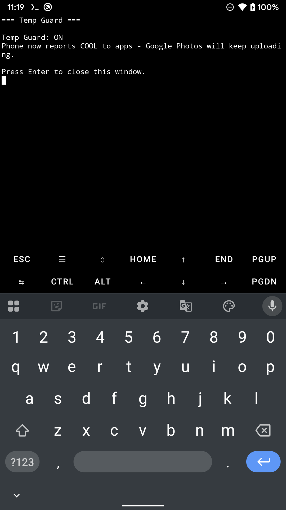
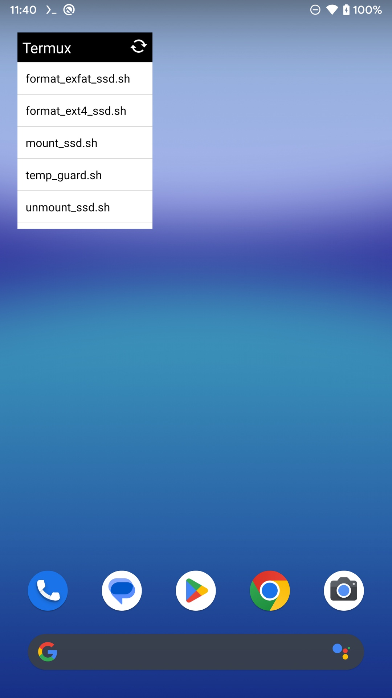

# Pixel Backup SSD

Turn a **rooted Google Pixel 1 / Pixel XL** into a machine with effectively **unlimited
photo storage** — by mounting a big external USB-C SSD and bind-mounting it *into* the
phone's internal storage, so Google Photos backs it up as if it were on the phone.

Everything is controlled from **home-screen buttons**. No terminal typing in daily use.

> [!WARNING]
> **Use at your own risk — read the [disclaimer](#disclaimer) before starting.** This is
> experimental software for **rooted** devices: it formats drives, mounts them into internal
> storage and overrides what the phone reports to apps. **You are responsible** for anything that
> happens to your phone, your SSD, your data or your hardware. No liability is accepted.

**Built on top of [master-hax/pixel-backup-gang](https://github.com/master-hax/pixel-backup-gang)**,
which provides the core trick — mounting an ext4 SSD so Android and its apps can see it.
On top of that foundation, this project adds four conveniences:

| | Added by this project | Why it matters |
|---|---|---|
| 🧭 | [It finds the drive for you](#it-finds-the-drive-for-you) | The drive is matched by its filesystem **label** — nothing to look up when you plug it in. |
| 💽 | [A formatter that lives in the phone](#a-formatter-that-lives-in-the-phone) | Format the SSD to **ext4** or **exFAT** from a button — no computer needed. |
| 🔘 | [No terminal: five home-screen buttons](#no-terminal-five-buttons-on-your-home-screen) | Plug in, tap, done. No `adb`, no typing, ever. |
| 🌡️ | [Temp Guard: uploads that never stop](#temp-guard-the-reason-uploads-never-stop) | Photos stops pausing for heat — **without** disabling the phone's real thermal protection. |

---

## Table of contents

- [Why this exists](#why-this-exists)
- [How it works](#how-it-works)
- [What this project adds](#what-this-project-adds)
  - [It finds the drive for you](#it-finds-the-drive-for-you)
  - [A formatter that lives in the phone](#a-formatter-that-lives-in-the-phone)
  - [No terminal: five buttons on your home screen](#no-terminal-five-buttons-on-your-home-screen)
  - [Temp Guard: the reason uploads never stop](#temp-guard-the-reason-uploads-never-stop)
- [What you get](#what-you-get)
- [Requirements](#requirements)
- [Connectivity: direct connection vs powered hub](#connectivity-direct-connection-vs-powered-hub)
- [Repository layout](#repository-layout)
- [Installation](#installation)
  - [Option A — automated installer](#option-a--automated-installer-recommended)
  - [Option B — manual install](#option-b--manual-install)
- [Daily use](#daily-use)
- [The scripts in detail](#the-scripts-in-detail)
- [Troubleshooting](#troubleshooting)
- [Technical notes](#technical-notes-critical-gotchas)
- [Rebuilding on a new phone](#rebuilding-on-a-new-phone)
- [Credits & license](#credits--license)
- [Disclaimer](#disclaimer)

---

## Why this exists

The **original Pixel 1 (2016)** was the only phone ever sold with **unlimited, free,
original-quality Google Photos uploads** — a perk Google never repeated. A used Pixel 1
is therefore still one of the cheapest ways to get unlimited full-resolution cloud backup.

The catch: it has only 32 GB or 128 GB of internal storage, and **Google Photos only
backs up files that live on internal storage**. Plug in a USB SSD and Photos will ignore it.

This project fixes that.

## How it works

```
 USB-C SSD (ext4, label "DRIVE")
        │
        │  1. mounted by root at  /mnt/my_drive
        ▼
 /mnt/my_drive/the_binding          ← a plain folder on the SSD
        │
        │  2. sdcardfs bind-mount (gid=9997, SELinux media_rw)
        ▼
 /mnt/runtime/write/emulated/0/the_binding
        │
        │  3. Android resolves this to the user-visible path
        ▼
 /storage/emulated/0/the_binding    ← "looks like" internal storage
        │
        │  4. Google Photos → Back up device folders → the_binding
        ▼
 ☁️  Unlimited original-quality upload
```

Because the bind point lives inside the emulated-storage tree, **Photos treats it as
internal storage** and will happily back it up — even though the bytes physically live on
the SSD.

The one non-obvious requirement: the mount must happen in the **global mount namespace**
(`mnt:[4026531840]`), otherwise Android's storage daemon and the apps can't see it.
That's what `su -M` (Magisk's `--mount-master`) is for.

## What this project adds

The original [pixel-backup-gang](https://github.com/master-hax/pixel-backup-gang) is a clean, purpose-built
toolkit, and it handles the genuinely difficult part: mounting the drive ext4 read-write, relabelling it
for SELinux and bind-mounting it through sdcardfs so that Android and its apps will actually see it. That
foundation is what makes all of this possible, and it is used here.

This project keeps that foundation and layers four conveniences on top of it, aimed at running the setup
as a daily appliance rather than a one-off experiment.

### It finds the drive for you

The original takes the block device as an argument:

```sh
Usage: $0 /dev/block/<label> e.g. $0 /dev/block/sdg1
```

So you tell it which drive to use — and the node changes on every plug (`sdg`, `sdh`, `sdh1`,
`sdb1`…), because the kernel hands out the next free letter. To help with that, the original ships
`find_device.sh` and `show_devices.sh`, which look it up for you.

This project adds an automation layer that removes the lookup entirely. `mount_drive.sh` identifies
the drive by its **filesystem label**, so it doesn't matter what the node is called this time:

```sh
DEV=$(blkid -t LABEL="$LABEL" | awk '{print $1}' | sed 's/.$//')
```

The same helper also takes care of the details around the mount, automatically:

- **a stale read-only mount** — Android can auto-mount removable storage read-only at boot, using a
  device name left over from an earlier session. The helper spots the `(ro` flag, clears the mount
  and remounts it read-write.
- **namespace handling** — it re-execs itself through `su -M`, so the mount lands in the global
  mount namespace where apps and the storage daemon can see it. That's what makes it possible to
  drive the whole thing from a home-screen button.
- **the media rescan** — it broadcasts a media-scanner update for the binding, so newly copied
  files appear in Google Photos without a reboot.

The result: nothing to look up, nothing to remember, and the Mount button can't be pointed at the
wrong device.

### A formatter that lives in the phone

The original is about reading a filesystem that's already there. This project adds two buttons that
create one — **entirely from the phone**, with no computer involved:

| Button | Format | Label | Use it for |
|---|---|---|---|
| **Format → ext4** | ext4, whole-disk (no partition table) | `DRIVE` | The backup drive — what this project needs |
| **Format → exFAT** | exFAT | `BACKUP` | Handing the SSD to a Mac or Windows machine |

Both are written to be safe to hand to someone who isn't a sysadmin:

- they ask you to **type `YES`** — plain Enter cancels, so a stray tap can't wipe 900 GB
- they **refuse to run while the SSD is mounted** ("Tap the Unmount SSD button first")
- they **refuse to run on a device that looks too small** to be the SSD — a sanity check that
  stops you formatting the wrong thing
- the ext4 path **zeroes the first 2 MB** first, clearing the MBR partition table that
  `mkfs.exfat` leaves behind — otherwise ext4 would land on a partitioned disk
- they **re-read the partition table** (`blockdev --rereadpt`) when done, so the new filesystem
  appears immediately
- the terminal window **stays open** showing the result until you press Enter

The exFAT one is the more interesting engineering. **Termux has no `mkfs.exfat`**, so the
installer downloads the `exfatprogs` package — plus the two shared libraries it needs,
`libblkid.so` and `libandroid-posix-semaphore.so` — straight from the Termux repository, unpacks
the `.deb` files and installs them into `/data/local/tmp/format-tools/`, wired up so the binary
actually runs. You end up with a working exFAT formatter on the phone, without ever touching a
computer.

### No terminal: five buttons on your home screen

The original's scripts are run from a root shell, typically over `adb` from a computer — a
perfectly reasonable way to set something up, but not what you want when you're away from your desk
and just want your photos uploading.

This project wraps the same scripts as **Termux:Widget buttons**. You add them to the home screen
once, and from then on the whole workflow is taps:

**Plug in → Mount SSD → upload → Unmount SSD → unplug.**

No `adb`, no terminal, no computer. The five buttons are listed in
[What you get](#what-you-get) below.

`install.sh` sets all of it up — including the parts that are invisible when you get them wrong.
The scripts must be **owned by the Termux user**, be executable, and carry the **Termux app's
SELinux context**, or Termux:Widget silently refuses to run them with no useful error.

Every button is written to be read by a human, not just by a shell: it prints a clear
`OK`/`FAILED` result and **waits for Enter** so the window doesn't vanish before you've read it.
All five are POSIX `sh` (`dash`-safe), because Termux's `sh` is `dash`, not bash.

### Temp Guard: the reason uploads never stop

This is the addition that matters most in practice, and it's the one nothing else gives you.

**The problem.** When a phone gets warm, Android tells apps about it. Google Photos treats that
as a signal to back off, and pauses or throttles backup once Android reports a thermal status of
MODERATE (2) or above. On a first full run of a 1 TB drive the phone *will* get warm — so the
upload stops. And it stops precisely when you've walked away and are relying on it to finish
overnight. You come back to a phone that has been warm, throttled and idle for hours.

**What Temp Guard does.** One tap changes what Android *reports* to apps:

| Command | Effect |
|---|---|
| `cmd thermalservice override-status 0` | Apps are told the device is **cool** → Photos keeps uploading |
| `cmd thermalservice reset` | Back to real temperature reporting |

The same button toggles both ways and remembers its state, so turning it off is just as easy.

**And no, this does not harm your phone.** This part is important to get right:

- It changes **only the status value that Android reports to apps**. It is not a hardware
  setting, and it doesn't touch the kernel, the thermal HAL or any driver.
- **Your phone's real thermal protection keeps running, unchanged.** The kernel and the thermal
  layer go on measuring the true temperature and will still throttle the CPU, reduce charging
  current when hot and — if things ever became genuinely dangerous — shut the device down. None
  of that is disabled, unloaded or bypassed.
- So the only thing that changes is that Photos is no longer *told to wait*. **The upload stops
  pausing, while your phone keeps protecting itself exactly as it did before.**

That's the whole point: the thermal machinery still guards the hardware, and the upload carries
on instead of stalling.

<p align="center">
  
  <br>
  <em>Temp Guard on: apps see a cool device, so Photos keeps uploading.</em>
</p>

Two operational notes:

- The override is **in-memory** — a reboot clears it. Just tap the button again.
- It only works through **Magisk's `/sbin/su`**. Termux's own `su` breaks the binder call to
  `thermalservice` and fails with "failed transaction". The shipped script already handles this.

⚠️ **Use it sensibly.** Temp Guard stops the *upload* from pausing — it doesn't cool the phone.
The hardware still gets hot, and sustained heat is what ages batteries and stresses components.
Keep the phone on a hard surface with airflow, out of a case pocket, and give it a break if it's
genuinely hot to the touch.

## What you get

Five tap-to-run buttons on your home screen:

| Button | Script | What it does |
|---|---|---|
| **Mount SSD** | `mount_ssd.sh` | Mounts the ext4 SSD and binds it into internal storage. Run this after plugging the SSD in. |
| **Unmount SSD** | `unmount_ssd.sh` | Safely unmounts the bind points and the SSD. **Always run before unplugging.** |
| **Format → ext4** | `format_ext4_ssd.sh` | Wipes the SSD and formats it **ext4 / label `DRIVE`** — the format used for the backup drive. |
| **Format → exFAT** | `format_exfat_ssd.sh` | Wipes the SSD and formats it **exFAT / label `BACKUP`** — for using the SSD on Mac/Windows. |
| **Temp Guard** | `temp_guard.sh` | Toggles a fake "cool" thermal status so Photos doesn't pause uploads when the phone gets hot. |

Two of these are the important day-to-day ones: **Mount SSD** and **Unmount SSD**.

<p align="center">
  
  <br>
  <em>The five scripts, ready to bind to home-screen buttons.</em>
</p>

## Requirements

**Phone**

- Google Pixel 1 or Pixel XL (`sailfish` / `marlin`)
- **Rooted with Magisk** — required, `su -M` is fundamental to how this works
- Stock Android 10 (verified on), Magisk 30.7
- Google Photos signed in (the unlimited-upload perk is tied to the device)

**SSD**

- USB-C external SSD of any size (verified with ~1 TB)
- **Plugged directly into the phone** — the simplest setup, and the one this project is verified
  on. A **powered** hub also works, but only if you follow the
  [connect sequence](#connectivity-direct-connection-vs-powered-hub). An **unpowered** hub will
  not work at all.
- Formatted ext4 (this repo's *Format → ext4* button does it) **or** exFAT for general use

**Apps**

- [Termux](https://f-droid.org/en/packages/com.termux/) from **F-Droid** (not the Play Store version — it's abandoned)
- [Termux:Widget](https://f-droid.org/en/packages/com.termux.widget/) from F-Droid — provides the home-screen buttons

**Computer** (only for the initial setup)

- macOS or Linux with `adb` and a USB cable
  - macOS: `brew install android-platform-tools`

## Connectivity: direct connection vs powered hub

**A hub is optional.** The simplest and most reliable setup — and the one this project was built
and verified on — is the SSD plugged **straight into the phone**. If you don't specifically need
a hub, don't use one.

**An unpowered hub will not work.** A hub without its own power supply tries to run the SSD off
the phone's USB-C port, and there isn't enough power for it. The drive never appears, so every
button reports "no SSD found". If you hit that, it's the hub — not the software.

**A powered hub (one with its own power adapter) can work**, but the order matters, and you have
to repeat it **every time the phone reboots**. Going straight to hub-then-SSD is the usual reason
the drive is never seen properly.

### The sequence

Follow these in order. Steps 1–4 are the mandatory part and apply **whether or not** you use a
hub — the SSD always goes directly into the phone first, on every boot.

| # | Do this | What you're checking for |
|---|---|---|
| 1 | With the phone on its own, plug the **SSD directly into the phone**. Nothing else attached — no hub, no other USB accessories. | The phone recognises and powers the drive |
| 2 | Tap **Mount SSD** | "OK: SSD mounted." |
| 3 | **Verify the mount** — open any file manager and look at the free space of `the_binding` | It shows the SSD's real capacity (e.g. ~916 GB), **not** 0 B |
| 4 | Tap **Unmount SSD**, wait for the confirmation, then unplug | Clean release of the direct attachment |
| 5 | Connect the **powered hub** to the phone, with its **power supply connected and switched on** | The hub is recognised |
| 6 | Plug the **SSD into the hub** | The drive is recognised through the hub |
| 7 | Tap **Mount SSD** again to mount it through the hub | "OK: SSD mounted." |

**Don't skip step 3.** A mount can silently come up read-only, or carry a stale device name left
over from a previous boot. Checking the capacity in a file browser is the quickest way to catch
that before you trust it with hundreds of gigabytes.

**If step 7 fails, blame the hub or its power supply.** Fall back to a direct connection: that
always works, and it's the configuration this project is verified on.

## Repository layout

```
pixel-backup-ssd/
├── README.md                    ← you are here
├── install.sh                   ← automated installer (runs on your Mac/Linux box)
├── DEVLOG.md                    ← full technical write-up, every gotcha + why
└── scripts/
    ├── phone/                   →  copied to /data/local/tmp/pixel-backup-ssd/
    │   ├── mount_drive.sh         (drive detection + mount orchestration)
    │   ├── mount_ext4.sh          (ext4 mount + sdcardfs bind)
    │   └── unmount.sh             (reverse of the above)
    └── shortcuts/               →  copied to ~/.shortcuts/ inside Termux
        ├── mount_ssd.sh           (button: Mount SSD)
        ├── unmount_ssd.sh         (button: Unmount SSD)
        ├── format_ext4_ssd.sh     (button: Format → ext4)
        ├── format_exfat_ssd.sh    (button: Format → exFAT)
        └── temp_guard.sh          (button: Temp Guard)
```

The split matters: `scripts/phone/` are **root-owned system scripts**, while
`scripts/shortcuts/` are the **user-facing Termux buttons**. `install.sh` places each set
in the right location with the right permissions.

## Installation

### Option A — automated installer (recommended)

1. Install **Termux** and **Termux:Widget** from F-Droid on the phone.
2. Enable **USB debugging** on the phone and plug it into your computer.
3. Allow the debugging prompt on the phone screen.
4. Run:

```bash
git clone https://github.com/shotbeat/pixel-backup-ssd.git
cd pixel-backup-ssd
chmod +x install.sh
./install.sh
```

The installer will:

- find your phone via `adb`
- push the three core scripts to `/data/local/tmp/pixel-backup-ssd/`
- install the five button scripts into `~/.shortcuts/` with the correct owner, permissions
  and SELinux context
- download and install the **exFAT tooling** (`mkfs.exfat` + libraries) needed by the
  *Format → exFAT* button
- print the final "add the widgets" step

If you have more than one device attached, pass a serial: `./install.sh YOUR-SERIAL`
(find yours with `adb devices`)

### Option B — manual install

<details>
<summary>Click to expand the step-by-step manual procedure</summary>

Set these once in your shell:

```bash
P=YOUR-SERIAL                                   # from `adb devices`
SSD=/data/local/tmp/pixel-backup-ssd
TH=/data/data/com.termux/files/home
```

**1. Core scripts (root-owned)**

```bash
adb -s $P shell "su -c 'mkdir -p $SSD'"
adb -s $P push scripts/phone/mount_drive.sh  $SSD/
adb -s $P push scripts/phone/mount_ext4.sh   $SSD/
adb -s $P push scripts/phone/unmount.sh      $SSD/
adb -s $P shell "su -c 'chmod 755 $SSD/*.sh'"
```

**2. Button scripts (must be owned by the Termux user)**

Find the Termux uid and SELinux context:

```bash
adb -s $P shell "stat -c %u $TH"                 # the Termux app's uid
adb -s $P shell "su -c 'ls -Zd $TH/.termux'"     # context template
```

Then install the shortcuts:

```bash
UID_TERMUX=YOUR_UID         # the number printed above
CTX="YOUR_CONTEXT"          # the label printed above, e.g.
                            # u:object_r:app_data_file:s0:cNNN,c256,c512,c768

adb -s $P push scripts/shortcuts/ /data/local/tmp/shortcuts/
adb -s $P shell "su -c '
  mkdir -p $TH/.shortcuts
  cp /data/local/tmp/shortcuts/*.sh $TH/.shortcuts/
  chown $UID_TERMUX:$UID_TERMUX $TH/.shortcuts/*.sh
  chmod 700 $TH/.shortcuts/*.sh
  chcon $CTX $TH/.shortcuts/*.sh
'"
```

**3. exFAT tooling (only needed for the exFAT format button)**

`mkfs.exfat` is not in Termux. Download these three aarch64 `.deb` packages from
`packages.termux.dev`, extract them, and push the binaries:

- `exfatprogs` → provides `mkfs.exfat`
- `libblkid` → `libblkid.so`
- `libandroid-posix-semaphore` → `libandroid-posix-semaphore.so`

```bash
TOOLS=/data/local/tmp/format-tools
adb -s $P shell "su -c 'mkdir -p $TOOLS/lib'"
adb -s $P push mkfs.exfat $TOOLS/
adb -s $P push libblkid.so $TOOLS/lib/
adb -s $P push libandroid-posix-semaphore.so $TOOLS/lib/
adb -s $P shell "su -c 'chmod 755 $TOOLS/mkfs.exfat'"
```

**4. Add the widgets**

Long-press the home screen → **Widgets** → **Termux:Widget** → drag out 5 buttons →
pick each script. Repeat for all five.

</details>

## Daily use

**The normal routine:**

1. Plug the SSD **directly** into the phone (USB-C). Using a powered hub instead? Follow the
   [connect sequence](#connectivity-direct-connection-vs-powered-hub) — the order matters.
2. Tap **Mount SSD**.
3. **Check the mount** in any file browser: `the_binding` should show the SSD's real capacity,
   not 0 B. This catches a read-only or stale mount before you rely on it.
4. Open Google Photos — uploads begin. Leave the phone on Wi-Fi and on a charger.
5. If uploads stall and the phone is warm, tap **Temp Guard** — see
   [Temp Guard](#temp-guard-the-reason-uploads-never-stop).
6. When done, tap **Unmount SSD**, *then* unplug.

**First-time setup inside Photos** (one time only):

1. Google Photos → your avatar → **Photos settings** → **Backup & sync**
2. → **Back up device folders** → enable **`the_binding`**

Without that toggle, Photos will never look inside the SSD — this is the step people
most often miss. Verify by copying one test photo to
`/storage/emulated/0/the_binding/` and confirming it appears in your Google Photos
library.

**If the phone overheats** and uploads stall: tap **Temp Guard** (it will say
`Temp Guard: ON`). Photos then sees a cool status and keeps uploading, while the phone's own
thermal protection carries on running untouched. Tap it again to return to real temperature
reporting. See [Temp Guard](#temp-guard-the-reason-uploads-never-stop) for what it does and
what it deliberately doesn't touch.

**Switching the SSD between the phone and a computer:**

| Where you want to use it | Format to | Label |
|---|---|---|
| Phone backup (this project) | ext4 | `DRIVE` |
| Mac / Windows / anything else | exFAT | `BACKUP` |

Use the two **Format** buttons. Each one asks you to type `YES` first, refuses to run if
the SSD is mounted, and refuses if the device looks too small to be the SSD.
**Formatting erases everything** — move your photos to the cloud first.

## The scripts in detail

| File | Purpose | Notable behaviour |
|---|---|---|
| `mount_drive.sh` | Orchestrator: finds the SSD, fixes a stale read-only mount, calls the ext4 mount, triggers a media rescan. | Locates the device by **label** (`blkid -t LABEL=DRIVE`), not by name — device names change between boots. |
| `mount_ext4.sh` | Mounts ext4 read-write at `/mnt/my_drive`, then bind-mounts via sdcardfs so apps can see it. | `chcon u:object_r:media_rw_data_file:s0` + `gid=9997` is what makes Android's storage layer accept it. |
| `unmount.sh` | Unmounts the two bind points and then the SSD itself. | Unmount order matters — bind points first, device second. |
| `mount_ssd.sh` | Button wrapper. | Reports OK/FAILED and pauses so you can read it. |
| `unmount_ssd.sh` | Button wrapper. | Checks `/proc/mounts` first, so tapping it when nothing is mounted gives a friendly message instead of an error. |
| `format_ext4_ssd.sh` | Wipes + formats ext4. | `dd` zeroes the first 2 MB to clear any MBR left behind by `mkfs.exfat`, then `mkfs.ext4 -F -L DRIVE -O ^metadata_csum,^64bit`. |
| `format_exfat_ssd.sh` | Wipes + formats exFAT. | `mkfs.exfat -F -L BACKUP`. The `-F` is mandatory — without it, formatting a drive that already has signatures fails. |
| `temp_guard.sh` | Toggles thermal override. | Uses a **state file** (not `dumpsys`) to decide on/off, because `dumpsys` can be blocked from the widget context. |

All button scripts are written in **POSIX `sh`**, because Termux's `sh` is `dash`, not bash.

## Troubleshooting

**The SSD isn't detected at all.**
Nine times out of ten it's the hub. Plug the SSD **directly into the phone, on its own**, with
nothing else attached, and try again — see
[Connectivity](#connectivity-direct-connection-vs-powered-hub). An unpowered hub can't supply the
power the drive needs, so it never appears.

**"No SSD found" when tapping a Format button.**
The script needs root to read `/sys/block/*`. The buttons escalate with `su -M` *before*
detecting the drive. If you're running the script manually, make sure you're root first.

**Photos says "impossibile liberare spazio" / uploads never finish.**
Check the *Back up device folders* toggle (see [Daily use](#daily-use)). If the SSD isn't
mounted, `the_binding` appears empty and Photos has nothing to send.

**A photo copied to the SSD doesn't show up in Photos.**
Copy through `/storage/emulated/0/the_binding/…`, **not** directly to `/mnt/my_drive/…`.
Writing to the raw mount bypasses sdcardfs and Android's media scanner never learns about
the file.

**Temp Guard says "failed transaction".**
You're running it as Termux's own `su`. Thermal commands must go through **Magisk's
`/sbin/su`** — Termux's wrapper loses the `DEVICE_POWER` capability and binder calls fail.
The shipped script already hardcodes `/sbin/su`.

**Temp Guard won't turn off.**
Fixed in this version — older versions probed `dumpsys` for the current state, which is
sometimes blocked from a widget, so the toggle always went "ON". It now uses a state file
at `~/.temp_guard_state`.

**"device has existing signatures, refusing to overwrite".**
`mkfs.exfat` needs `-F`. Already handled in `format_exfat_ssd.sh`.

**Format fails / the drive won't format on a Mac either.**
A kernel log like `I/O error [0xe00002ca] dir 0x0 lba 0x0 … retry 20` means the drive is
failing to *write to sector 0*. That's hardware, not software. Try: a different cable, a
different port, a different enclosure/adapter, or plug it directly into a computer and
re-run `diskutil eraseDisk`. If sector 0 cannot be written anywhere, the drive is done.

**The mount disappears after a reboot.**
Expected — mounts are not persistent across reboots. Just plug the SSD in and tap
**Mount SSD** again.

**Android mounted the SSD read-only by itself at boot.**
Stock Android auto-mounts removable storage read-only, which can leave a stale read-only
mount that blocks the real one. `mount_drive.sh` detects this and clears it automatically.

**adb lost the wireless connection after reboot.**
Re-run `adb tcpip 5555` while connected over USB. Wireless debugging does not survive a
reboot on this setup.

## Technical notes (critical gotchas)

These are the things that will waste your afternoon if you don't know them. The full
narrative is in [`DEVLOG.md`](DEVLOG.md).

1. **The mount must be in the global mount namespace** (`mnt:[4026531840]`).
   Use `su -M` (Magisk `--mount-master`). Without it, apps and the storage daemon can't
   see the mount.
2. **`nsenter -t 1 -m` does not work** from an app context — it's blocked. `su -M` is the
   supported route.
3. **Two different `su` binaries exist.** Termux ships its own `su`
   (`/data/data/com.termux/files/usr/bin/su`); Magisk has `/sbin/su`. Termux's version
   **breaks binder calls** to `thermalservice` and corrupts mounts. Always use `/sbin/su`
   for anything touching Android services.
4. **A double `su` drops capabilities.** `su -c 'su -c …'` loses MAGISK/DAC capabilities
   and will fail in surprising ways.
5. **The Termux *app* cannot read `/sys/block/*`** — root can. Always escalate before
   detecting block devices.
6. **Termux's `sh` is `dash`, not bash.** No arrays, no `[[ ]]`, no `$'…'`. Keep scripts
   POSIX.
7. **Find the SSD by label, not device name.** `/dev/block/sda1` today may be `sdb1`
   tomorrow.
8. **Android auto-mounts removable storage read-only at boot** — clear any stale mount
   before mounting read-write.
9. **`mkfs.exfat` requires `-F`** to overwrite a drive that already has filesystem
   signatures.
10. **`mkfs.exfat` writes an MBR partition table.** That's why the ext4 script `dd`s the
    first 2 MB before formatting — otherwise ext4 lands on a partitioned drive.
11. **Never format while mounted.** Both format buttons refuse and tell you to unmount.
12. **Always unmount before unplugging.** A dirty ext4 volume will force a filesystem
    check (or worse) on next mount.
13. **A hub needs its own power supply, and the connect order matters.** An unpowered hub can't
    deliver enough power, so the drive never enumerates. A *powered* hub works, but you have to
    let the system see the SSD **directly first, on every boot**. Step-by-step:
    [Connectivity](#connectivity-direct-connection-vs-powered-hub).
14. **Wireless adb is lost on every reboot.** `adb tcpip 5555` again over USB.
15. **SELinux context matters for shortcuts.** The button scripts must carry the
    Termux app's context (an `app_data_file` label carrying the app's category set), or
    Termux:Widget can't execute them.

## Rebuilding on a new phone

This is the "recover whenever I want" path. On a fresh phone:

1. Unlock the bootloader and install **Magisk** (root is required — see
   [Requirements](#requirements)).
2. Install **Termux** and **Termux:Widget** from F-Droid.
3. Clone this repo on a computer and run `./install.sh` (with the phone connected over USB).
4. Add the five buttons: long-press home → **Widgets** → **Termux:Widget** → drag out 5 →
   select each script.
5. Plug in the SSD, tap **Mount SSD**.
6. In Google Photos, enable **Back up device folders → `the_binding`**. Uploads start.

Because the SSD already holds the files in ext4 format, everything on it becomes visible
again as soon as it's mounted. Nothing needs to be re-copied.

## Credits & license

**Original project:** [`master-hax/pixel-backup-gang`](https://github.com/master-hax/pixel-backup-gang)
by [@master-hax](https://github.com/master-hax). The hard part is theirs — the ext4 mount, the sdcardfs
bind, and the SELinux relabelling that make Android and its apps see the drive. Everything here stands
on that foundation, with thanks.

`scripts/phone/mount_ext4.sh` and `scripts/phone/unmount.sh` are **modified copies** of their work: the
namespace guard was made tolerant so they can also run from an app context, and they're now driven by
this project's label-based detection. Please respect and support the original project; it has no license
file, so treat it as "all rights reserved by its author" and link to it rather than redistributing it as
your own.

**Added by this project:** `mount_drive.sh` (automatic **label-based** SSD detection, stale read-only
mount recovery, `su -M` namespace escalation and the media rescan), the five Termux:Widget buttons, the
ext4 **and** exFAT formatters with their tooling bootstrap, the thermal-override toggle, and this
documentation.

**Termux packages used:** `exfatprogs` (mkfs.exfat), `libblkid`,
`libandroid-posix-semaphore`, downloaded from `packages.termux.dev`.

## Disclaimer

**Read this before using anything in this repository.**

This is a hobby project that modifies system-level behaviour on a **rooted** device. It is
provided **as-is, with no warranty of any kind**, express or implied.

By using it you accept that:

- **You are solely responsible for your device, your data and your hardware.** The author(s) and
  contributors accept **no responsibility and no liability** for any damage, data loss,
  corruption, bricking, overheating, fire, injury or financial loss resulting from the use of
  this software — including any damage to your phone, your SSD, your computer, or anything
  connected to them.
- **The format buttons erase the SSD completely and irreversibly.** There is no undo and no
  recovery. Be certain you have selected the right drive and that you don't need its contents.
- **Temp Guard changes what your phone reports to apps.** It does **not** disable the kernel or
  hardware thermal protection, and the device will still throttle and shut itself down if it
  becomes genuinely too hot. But it does let the phone carry on working — and heating — in
  conditions where an app would otherwise have paused. Sustained heat ages batteries and stresses
  components. Use it deliberately, keep the phone ventilated, and don't leave an overheating
  device unattended.
- **Rooting voids warranties and weakens the device's security model.**
- **Mounting removable storage into internal storage is inherently risky.** A crash, a bug, or an
  unplug at the wrong moment can leave a filesystem dirty or files half-written.
- **Never rely on a single copy of anything.** Keep another backup of anything you care about.
  This project is a convenience, not a backup strategy.
- **Test it yourself before trusting it.** Verify the mount, verify the upload, verify the unmount.

If that isn't acceptable to you, please don't use this project.

This project is not affiliated with, endorsed by, or supported by Google, Google Photos, Termux,
Magisk, or the `pixel-backup-gang` project. All trademarks belong to their respective
owners.

You are free to choose a license for *your* additions. If you publish this, a permissive
license such as MIT is a reasonable choice for the scripts authored here.
